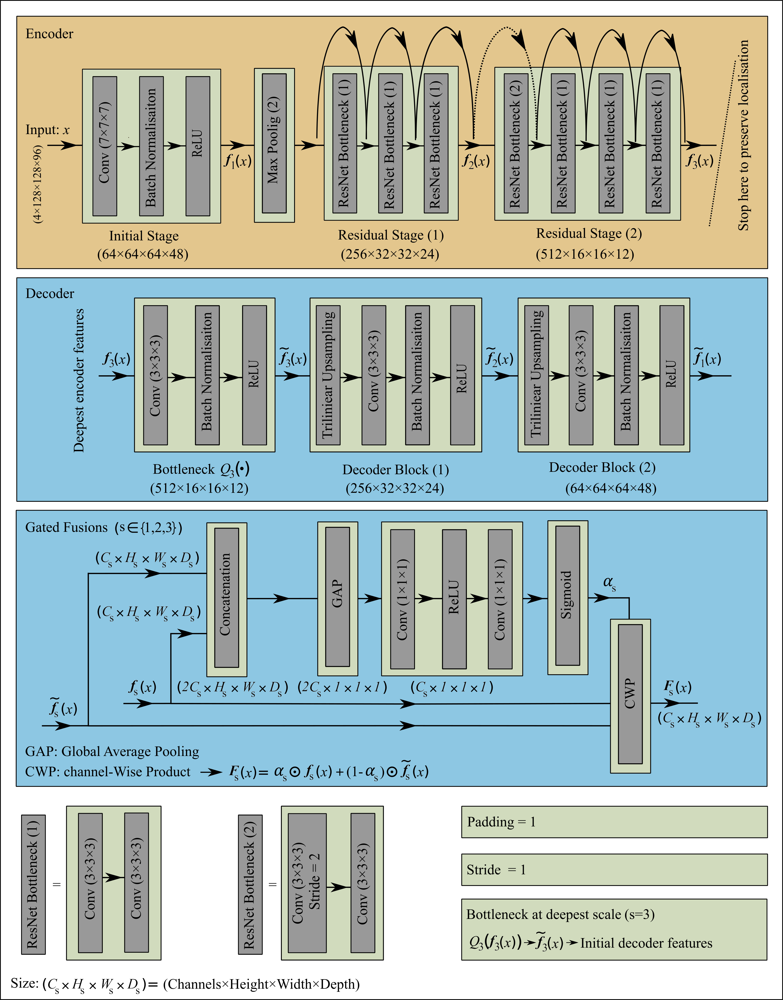
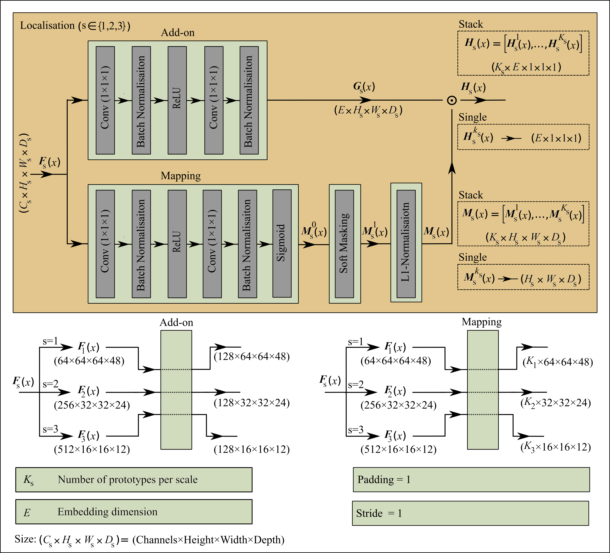

This repository contains the official implementation of **UM-ProtoShare** from the paper “**UM-ProtoShare: UNet-Guided, Multi-Scale Shared Prototypes for Interpretable Brain Tumour Classification Using Multi-Sequence 3D MRI**” (under review at **MIDL 2026**) by **Ali Golbaf, Vivek Singh, Swen Gaudl, and Emmanuel Ifeachor**.
## Model Overview
### 🔄 UM-ProtoShare Workflow

---
## Architecture
### 🧠 Backbone: 3D ResNet-152 + Lightweight UNet Decoder + Gated Fusions

Key points:
- **3D ResNet-152** encoder (Truncated to preserve localisation).
- **Lightweight decoder** with trilinear upsampling.
- **Gated encoder–decoder fusion** at each scale to balance semantics and localisation.
---
### 📍 Localisation & Prototype Matching

Key points:  
* **add-on module** to extract high level features and get fixed-dimensional embeddings.  
* **mapping module** that predicts per-prototype attention maps.  
A soft-masked, normalised mapping produces prototype-specific descriptors that are compared (via cosine similarity) with shared prototypes. These similarities are then used for classification and for generating 3D activation maps.*
Core ideas:
- Shared **class-agnostic prototypes** at multiple scales
- Per-prototype attention maps with soft-masked normalisation
- Cosine similarity between prototype vectors and masked feature descriptors
- Online-CAM and diversity regularisation to sharpen and diversify prototype usage
