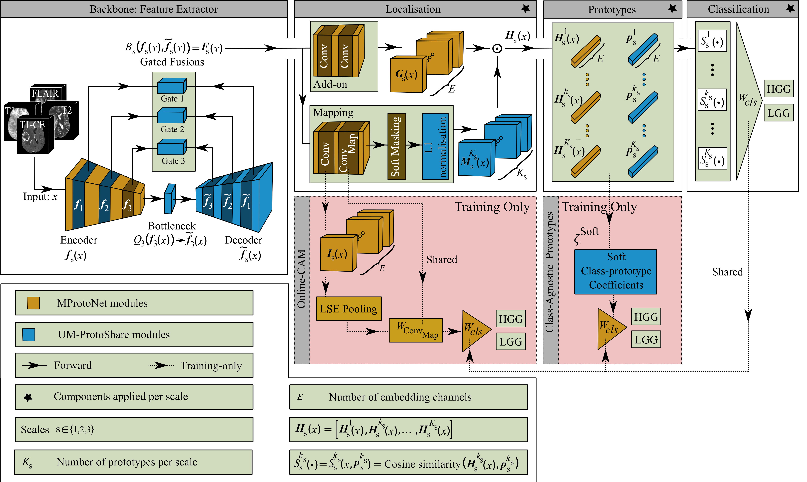

# UM-ProtoShare
This repository contains the official implementation of **UM-ProtoShare** from the paper “**UM-ProtoShare: UNet-Guided, Multi-Scale Shared Prototypes for Interpretable Brain Tumour Classification Using Multi-Sequence 3D MRI**” (under review at **MIDL 2026**) by **Ali Golbaf, Vivek Singh, Swen Gaudl, and Emmanuel Ifeachor**.
### 🔄 UM-ProtoShare Workflow

---
### 🧠 Core ideas
* **Shared, class-agnostic prototypes**  
  UM-ProtoShare learns a bank of shared, class-agnostic prototypes instead of class-specific ones. Each prototype can support multiple classes through soft class–prototype coefficients derived from Grad-CAM-style importance weights. This allows the model to efficiently reuse MRI features that genuinely occur across tumour grades (e.g. peritumoural oedema, necrotic cores, enhancing rims) and reduces redundancy in the prototype space.
* **Weakly supervised localisation with gated fusions**  
  The model improves localisation over prior case-based methods (MProtoNet, MAProtoNet) by adding a lightweight 3D UNet-style decoder with encoder–decoder gated fusion blocks. Trained only with image-level labels, this backbone produces spatially coherent feature maps so that prototype evidence aligns with tumour-related regions, while preserving strong classification performance.
* **Explicit multi-scale prototypes**  
  UM-ProtoShare learns separate prototype sets at multiple spatial scales, capturing tumour appearance from fine to coarse resolutions. By varying how many prototypes are allocated to each scale, we can explicitly study how emphasising different spatial scales trades off between classification accuracy and interpretability.

### Experiment
#### Training the Backbone
```python
python main_Code.py \
  -di /path/to/MICCAI_BraTS2020_TrainingData \
  -dc /path/to/clinical_dir \
  --clinical-csv name_mapping.csv \
  --seed 0 \
  --cv-folds 5 \
  --cv-repeats 1 \
  --backbone resnet152_ri \
  --n-layers 6 \
  --train-backbone True \
  --epochs-bb 50 \
  --batch-size-bb 1 \
  --num-workers-bb 1 \
  --lr-bb 1e-3 \
  --wd-bb 1e-2 \
  --class-loss-bb focal \
  --optim-bb Adam \
  --train-um False \
  --save-model True
```

##### Training UM-ProtoShare
```python
python main_Code.py \
  -di /path/to/MICCAI_BraTS2020_TrainingData \
  -dc /path/to/clinical_dir \
  --clinical-csv name_mapping.csv \
  --seed 0 \
  --cv-folds 5 \
  --cv-repeats 1 \
  --p-mode 5 \
  --backbone resnet152_ri \
  --n-layers 6 \
  --num-prototypes 30 \
  --use-unet True \
  --freeze-unet False \
  --fusion gated \
  --train-um True \
  --epochs-um 100 \
  --batch-size-um 1 \
  --num-workers-um 1 \
  --lr-um 1e-3 \
  --wd-um 1e-2 \
  --class-loss-um focal \
  --optim-um AdamW \
  --warmup True \
  --warmup-ratio 0.2 \
  --use-augmentation True \
  --save-model True \
  --coefs "{'cls': 1, 'clst': 0.8, 'sep': -0.08, 'L1': 0.01, 'map': 0.5, 'OC': 0.05, 'div': 0.01}"
```

### Acknowledgment
This repository contains modified source code from [MProtoNet](https://github.com/aywi/mprotonet) by Yuanyuan Wei, Roger Tam, and Xiaoying Tang.

### Citation
```bibtex
@inproceedings{Golbaf2026UMProtoShare,
  title     = {UM-ProtoShare: UNet-Guided, Multi-Scale Shared Prototypes for Interpretable Brain Tumour Classification Using Multi-Sequence 3D MRI},
  author    = {Golbaf, Ali and Singh, Vivek and Gaudl, Swen and Ifeachor, Emmanuel},
  booktitle = {Proceedings of the International Conference on Medical Imaging with Deep Learning (MIDL)},
  year      = {2026},
  note      = {Full paper, under review}
}


